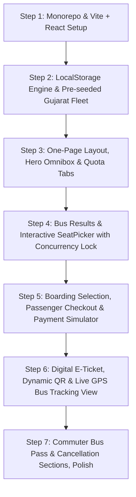

# Next-Generation GSRTC Travel & Bus Reservation Platform: One-Page Architecture & Implementation Plan

A high-performance, accessible bus booking and transit platform inspired by the **Gujarat State Road Transport Corporation (GSRTC)**, built as a unified **One-Page React Application (Vite + TypeScript + Tailwind CSS)** powered by a **LocalStorage Data & State Engine** (`GSRTCStorageEngine`) with **Real-Time Atomic Seat Concurrency Locking**.

---

## User Review Required

> [!IMPORTANT]
> **Key Architecture Decisions (All User Preferences Incorporated)**:
> 1. **Single-Page Application (One-Page Experience)**:
>    - Everything is contained within a unified, seamless one-page interface. No disjointed page refreshes.
>    - Fluid animated steps: **Search & Quotas** ➔ **Bus Selection** ➔ **Interactive SeatPicker & Concurrency Lock** ➔ **Passenger Details** ➔ **Checkout & Payment** ➔ **Digital E-Ticket with Live QR Code**.
>    - Dedicated top-level tab views on the same page for:
>      - 🚌 **Book Bus** (Main interactive booking flow)
>      - 📍 **Live Bus Tracker** (Real-time GPS bus movement on interactive route timeline)
>      - 🎫 **Digital Bus Pass** (Commuter & Student bus pass generator)
>      - ❌ **Cancel & Refund** (Self-service policy refund calculator)
>      - 📂 **My Bookings** (Quick access drawer for all stored tickets)
> 2. **Real-Time Seat Locking & Concurrency Protection**:
>    - When a user in Tab 1 clicks a seat, an atomic lock is saved in `localStorage` with a **10-minute hold countdown timer**.
>    - `BroadcastChannel` instantly notifies all other open tabs/windows: **that seat turns Amber/Striped with a 🔒 lock icon and is disabled from being clicked**.
>    - If another user tries to click it, they get a notice: *"Held by another passenger"*.
>    - On payment completion, it turns permanently **Booked (Red)**. On deselect or timer expiry, it automatically unlocks back to **Available (Green)** across all tabs.
> 3. **Tech Stack**:
>    - **Frontend**: React JS (Vite + TypeScript)
>    - **Styling**: Tailwind CSS (Gujarat transit palette: Royal Navy `#002B49`, Kesari Saffron `#E8590C`, Emerald Green `#059669`, glassmorphism)
>    - **Backend/State**: LocalStorage Data Engine (Pre-seeded with 30+ Gujarat stations, bus types, and daily schedules)
>    - **Accessibility**: Web Speech API for Gujarati & English voice readouts
>    - **Structure**: Clean Monorepo layout (`apps/web`, `packages/types`, `packages/ui`)

---

## One-Page Layout & Visual Workflow

```
+-----------------------------------------------------------------------------------------+
|  [GSRTC Logo]   [Book Bus]  [Live Tracker]  [Bus Pass]  [Cancel/Refund]  [My Tickets (2)]   |
|  [EN | ગુજરાતી | हिंदी]  [🔊 Voice Assist: ON]  [GSRTC Wallet: ₹1,250]                    |
+-----------------------------------------------------------------------------------------+
|                                                                                         |
|  === STEP 1: HERO OMNIBOX & QUOTA SELECTOR ===                                          |
|  [ From: Ahmedabad (Geeta Mandir) ] <-> [ To: Statue of Unity ] [ Date: 12 Sep 2026 ]   |
|  Quotas: [● General] [ Single Lady ] [ Divyang ♿] [ MP/MLA ] [ AWT ] [ Electric Bus ]  |
|                                                                                         |
+-----------------------------------------------------------------------------------------+
|                                                                                         |
|  === STEP 2: AVAILABLE BUS SERVICES (Filtered in real time) ===                         |
|  Filters: [All Types] [Gurjarnagari] [Express] [Sleeper] [Volvo AC] | Sort: [Cheapest]  |
|                                                                                         |
|  +-----------------------------------------------------------------------------------+  |
|  | 06:30 AM  ─────(4h 15m)─────> 10:45 AM | VOLVO AC SLEEPER (2+1)   |  ₹480/seat   |  |
|  | Geeta Mandir -> Statue of Unity        | 14 Seats Free (3 Ladies) | [Select Seat] |  |
|  +-----------------------------------------------------------------------------------+  |
|                                                                                         |
+-----------------------------------------------------------------------------------------+
|                                                                                         |
|  === STEP 3: INTERACTIVE SEATPICKER 2.0 & REAL-TIME CONCURRENCY LOCK ===                |
|  [Lower Deck]  [Upper Deck]      ⏳ Lock Timer: 09:48 Remaining                         |
|                                                                                         |
|  [Driver Cabin]                                                                         |
|   Seat 1 [Avail]     Seat 2 [Avail]        Aisle      Seat 3 [Selected: You]            |
|   Seat 4 [Ladies]    Seat 5 [🔒 Held by User B]       Seat 6 [Booked]                   |
|   Seat 7 [Divyang]   Seat 8 [Avail]                   Seat 9 [Avail]                    |
|                                                                                         |
|  Legend: 🟢 Available  🔵 Selected  🔒 Held by Another User  🔴 Booked  🟣 Ladies Quota|
+-----------------------------------------------------------------------------------------+
|                                                                                         |
|  === STEP 4: BOARDING POINT & PASSENGER CHECKOUT ===                                    |
|  Boarding Stop: [ Ahmedabad Geeta Mandir Platform 4 - 06:15 AM (Reporting) ]           |
|  Passenger: [ Rahul Patel, Age: 28, Male ]                                              |
|  Fare Summary: Base ₹480 + Toll ₹15 + GST ₹24.75 = Total: ₹519.75                       |
|  Payment: [ Instant UPI QR / GPay / PhonePe ] [ Pay via GSRTC Wallet ] [Complete Pay]  |
|                                                                                         |
+-----------------------------------------------------------------------------------------+
|                                                                                         |
|  === STEP 5: DIGITAL E-TICKET & ACTIONS ===                                             |
|  PNR: GSRTC-839201  |  Status: CONFIRMED  |  Seat: 3 (Lower Deck)                       |
|  [Dynamic QR Code]   [🖨️ Print/PDF]  [📲 Send to WhatsApp]  [📍 Track Bus Live Now]      |
+-----------------------------------------------------------------------------------------+
```

---

## Real-Time Concurrency Seat Locking Engine (`SeatLockService`)

1. **Lock Acquisition**:
   - When User A clicks Seat #3, `SeatLockService.tryLockSeat(scheduleId, seatNo, sessionId)` verifies the seat is not already held or booked.
   - If free, it saves `{ seatNo: 3, lockedBy: 'UserA_sessId', lockedUntil: Date.now() + 600000 }` to `localStorage`.
   - Sends a message via `BroadcastChannel('gsrtc_seat_channel')`.
2. **Instant Multi-Tab Blocking**:
   - In Tab 2, the seat automatically re-renders with:
     - Warning amber diagonal stripes
     - 🔒 Lock icon
     - Disabled click state
     - Hover tooltip: *"This seat is currently held by another passenger. It will be released if not booked within the time limit."*
3. **Auto-Release or Confirmation**:
   - **On Payment Success**: Converts to a permanent confirmed booking in `gsrtc_bookings`.
   - **On Deselect**: Releases lock and broadcasts to immediately turn it back to available.
   - **On Expiration (10 mins)**: Garbage collection interval releases the seat automatically.

---

## Monorepo & Project Structure

```
gdg_tec_bvn/
├── apps/
│   └── web/                                # One-Page React App (Vite + TypeScript + Tailwind CSS)
│       ├── src/
│       │   ├── App.tsx                     # One-Page layout container & active section manager
│       │   ├── main.tsx                    # React Root
│       │   ├── index.css                   # Tailwind CSS setup & transit design tokens
│       │   │
│       │   ├── components/                 # Cohesive modular components
│       │   │   ├── hero/                   # Omnibox, CityAutocomplete, DateSelector, QuotaTabs
│       │   │   ├── buses/                  # BusList, BusCard, FilterBar, AmenitiesBadges
│       │   │   ├── seatmap/                # SeatPicker, LowerDeck, UpperDeck, LockCountdown, SeatLegend
│       │   │   ├── checkout/               # BoardingSelector, PassengerForm, FareSummary, PaymentModal
│       │   │   ├── ticket/                 # DynamicQrTicket, PrintTicketView, WhatsAppShare
│       │   │   ├── tracking/               # LiveBusTrackerSection, RouteTimelineMap, SpeedBadge
│       │   │   ├── pass/                   # BusPassSection, DigitalPassCard, PassApplicationForm
│       │   │   ├── cancel/                 # CancellationSection, RefundCalculator
│       │   │   └── layout/                 # Navbar, MyBookingsDrawer, LanguageToggle, VoiceAssist
│       │   │
│       │   ├── services/                   # LocalStorage Data Layer & Concurrency Engine
│       │   │   ├── seedData.ts             # 30+ Gujarat stations, bus types, schedules, checkpoints
│       │   │   ├── storageEngine.ts        # LocalStorage CRUD & versioning
│       │   │   ├── busService.ts           # Search, schedule queries, route stops
│       │   │   ├── seatLockService.ts      # Atomic 10-min hold with BroadcastChannel
│       │   │   ├── bookingService.ts       # PNR generator, ticket persistence, wallet
│       │   │   └── trackingService.ts      # Real-time GPS movement simulation
│       │   │
│       │   └── hooks/
│       │       ├── useSeatLocks.ts         # Reactive seat locks listener & countdown timer
│       │       └── useLanguage.ts          # English / Gujarati / Hindi dictionary
│       │
│       ├── package.json
│       ├── tsconfig.json
│       └── vite.config.ts
│
├── packages/
│   ├── types/                              # Shared TypeScript models (Station, Bus, Schedule, Booking)
│   │   ├── src/index.ts
│   │   └── package.json
│   └── ui/                                 # Shared UI primitives (Button, Modal, Badge, Card)
│       ├── src/index.ts
│       └── package.json
│
├── pnpm-workspace.yaml                     # Workspace configuration
├── turbo.json                              # Turborepo task pipeline
├── package.json                            # Root scripts (pnpm dev, pnpm build)
└── README.md
```

---

## Detailed Implementation Steps



### Step 1: Monorepo & Vite + React Setup
- Configure root `pnpm-workspace.yaml`, `package.json`, and `turbo.json`.
- Initialize `apps/web` with Vite, React (TypeScript), and Tailwind CSS.
- Configure Gujarat transit theme (Royal Blue, Kesari Saffron, Emerald Green, smooth glassmorphic cards).

### Step 2: LocalStorage Engine & Pre-Seeded Gujarat Transit Data
- Implement `GSRTCStorageEngine` with automatic initial seed population.
- Pre-populate 30+ Gujarat stations (Ahmedabad Geeta Mandir, Vadodara, Surat, Rajkot, Bhavnagar, Statue of Unity, Somnath, Dwarka, Bhuj), bus categories, and realistic schedules.
- Implement `BroadcastChannel` and `storage` event listeners for cross-tab reactivity.

### Step 3: One-Page Layout, Hero Omnibox & Quota Tabs
- Build top navigation with smooth scroll/tab jumps: *Book Ticket*, *Live Tracking*, *Bus Pass*, *Cancel/Refund*, and *My Bookings*.
- Build Hero Omnibox with English & Gujarati autocomplete, 1-click station swap, and 6 Quota tabs (General, Single Lady, Divyang, MP/MLA, AWT, Electric, Statue of Unity).

### Step 4: Bus Results & Interactive SeatPicker with Concurrency Lock
- Display filtered bus services with departure/arrival times, duration, amenities, and pricing.
- In-place expandable **SeatPicker 2.0**:
  - Lower deck vs. Upper deck for sleeper coaches, 2x2/3x2 layouts for seaters.
  - Integrate `SeatLockService`: clicking a seat starts a 10-minute hold timer in Tab 1 and immediately locks it as 🔒 disabled in Tab 2.
  - Enforce Single Lady safety rule (solo male passengers cannot book adjacent to a single female seat).

### Step 5: Boarding Selection, Passenger Checkout & Payment Simulator
- Boarding/dropping stop selection with reporting times and platform details.
- Dynamic passenger details form.
- Transparent price breakdown (Base fare + Toll + Passenger amenities + GST).
- 1-Click checkout simulator with UPI QR Code, GPay/PhonePe buttons, and simulated GSRTC Wallet.

### Step 6: Digital E-Ticket, Dynamic QR & Live GPS Bus Tracking View
- Instant PNR generation with digital ticket card and dynamic QR code.
- 1-Click print-ready / PDF download layout.
- In-page Live GPS Bus Tracking view showing bus progress along stations, current speed, and next stop ETA.

### Step 7: Commuter Bus Pass & Cancellation Sections, Voice Polish
- Commuter & Student pass generator with instant digital pass card preview.
- 1-Click Ticket Cancellation with automated refund calculation.
- Web Speech API voice guidance for Divyang accessibility (English & Gujarati).

---

## Verification & Concurrency Testing

1. **Multi-Tab Seat Lock Concurrency Test**:
   - Open Tab 1 and Tab 2 on `http://localhost:5173` side by side.
   - Select a bus and click Seat #12 in Tab 1.
   - Verify:
     - Tab 1 displays an active countdown badge (`⏳ 09:59 remaining`).
     - Tab 2 **instantly turns Seat #12 Amber/Striped with a 🔒 Lock icon and disables clicking**.
     - Clicking Seat #12 in Tab 2 shows an alert toast: *"This seat is currently held by another passenger."*
     - Complete payment in Tab 1 -> Seat #12 permanently turns Red (Booked) in Tab 2.
2. **Complete One-Page Flow**:
   - Search "Ahmedabad" to "Statue of Unity" -> Select bus -> Pick seats -> Enter passenger details -> Complete simulated payment -> Verify E-Ticket with QR code appears -> Jump to Live GPS tracker.
3. **Pass & Cancellation**:
   - Generate a student pass -> View digital pass card.
   - Cancel a booked ticket -> Verify refund calculation is credited back to the simulated wallet.
